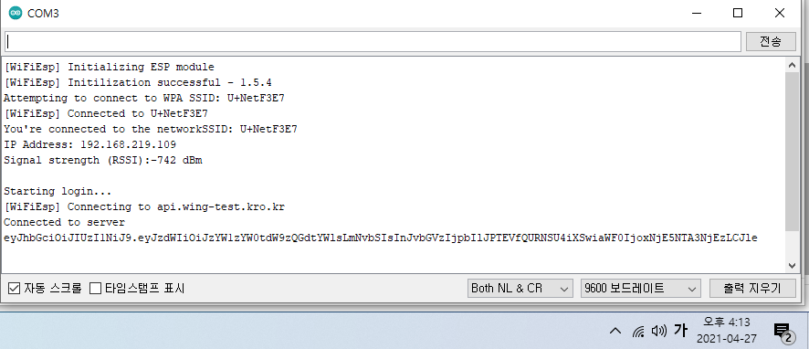

[버튼 모듈 연결](#버튼 모듈 연결)

[슬립모드 깨우기](#슬립모드 깨우기)


# 버튼 모듈 연결

* OUT => 3 pin
* VCC => 5V
* GND => GND

```c
void setup() {
  Serial.begin(9600);   // 시리얼 통신을 시작, 통신속도는 (9600)
  pinMode(2, INPUT); // 디지털 3번 핀을 입력모드로 설정
}

void loop() {
  int a = digitalRead(2);  // 정수형 변수 a를 생성한 후 디지털 3번핀에 입력되는 신호를 입력
  if (a == HIGH) {     // a가 HIGH (1)이면 (버튼을 누르지 않으면)
    Serial.println("Do not press");  // 시리얼 모니터에 Do not press을 입력)
    delay(2000);   // 2초간 대기

  }
  else {    // 그게 아니라면 (a가 HIGH가 아니라면) (버튼을 누르면)
    Serial.println("Press down");                                      // 시리얼 모니터에 Press down을 입력
    delay(2000);  // 2초간 대기
  }
}
```

참고 : https://m.blog.naver.com/PostView.nhn?blogId=roboholic84&logNo=221014246406&proxyReferer=https:%2F%2Fwww.google.com%2F


## 버튼 이벤트가 한 번만 발생하게 하기

```c
attachInterrupt(0, wakeUp, LOW);
=> attachInterrupt(0, wakeUp, FALLING);
```

attachInterrupt(인터럽트번호, 핸들러, 모드)

모드는 언제 트리거 되어야하는 지를 의미하며 다음 5가지 모드가 있다.

* LOW : pin이 low일 때
* CHANGE : pin이 바뀔 때
* RISING : pin이 low에서 high로 바뀔 때
* FALLING : pin이 high에서 low로 바뀔 때
* HIGH : pin이 high일 때 

LOW나 HIGH 모드의 경우 버튼 클릭 시 이벤트가 여러 번 호출되고, CHANGE는 2번 호출되므로 FALLIGN이나 RISING을 사용하도록 하자.


# 슬립모드 깨우기

* LowPower.h를 추가한다.
  * https://github.com/rocketscream/Low-Power 에서 zip 파일로 다운받아 "스케치 => 라이브러리 포함하기 => .ZIP 라이브러리 추가"로 추가하기

<내부 타이머로 깨우는 예제>

```c
#include <LowPower.h>
 
const int wakeUpPin = 2;  //pin of interrupt 0
 
void setup() {
  Serial.begin(9600);   // 시리얼 통신을 시작, 통신속도는 (9600)
  pinMode(wakeUpPin, INPUT);
  Serial.println("Start....");
}

void loop() {
  Serial.println("Sleep Start");
  for (int i = 0; i < 450; i++) { // 1시간에 한 번 호출
      // i<1로 변경하여 8초에 한 번 호출하는 지 확인해볼 수 있음
    LowPower.powerDown(SLEEP_8S, ADC_OFF, BOD_OFF); // 8초 * 450 = 3600초
  }
  // 여기서 api 호출
  Serial.println("api 호출");
  delay(2000);
}
```


<버튼을 사용하여 깨우는 예제>

```c
#include <LowPower.h>
 
const int wakeUpPin = 2;  //pin of interrupt 0
 
void setup() {
  Serial.begin(9600);   // 시리얼 통신을 시작, 통신속도는 (9600)
  pinMode(wakeUpPin, INPUT);
  Serial.println("Start....");
}

void loop() {
  Serial.println("Sleep Start");
  attachInterrupt(digitalPinToInterrupt(wakeUpPin), wakeUp, FALLING);
    
  LowPower.powerDown(SLEEP_FOREVER, ADC_OFF, BOD_OFF);
  // 여기서 api 호출
  Serial.println("api 호출");
    
  detachInterrupt(0);
  delay(2000);
}
 
void wakeUp()
{ // 버튼을 누를 때 호출 되는 핸들러
  Serial.println("Sleep End");
  delay(2000);
}
```


참고 : https://www.circuitbasics.com/lowering-arduino-power-requirements-using-sleep-mode/

https://twinw.tistory.com/124


## 최종 코드

```c
void wakeUp(){
  Serial.println("Button interrupt");
  isButtonClicked = true;
}

void loop() {
  attachInterrupt(digitalPinToInterrupt(BUTTON_PIN), wakeUp, FALLING);
    /* Falling일 때 wakeUp이 trigger 되고 PIN이 LOW가 됨
     => LowPower의 sleep에서 깨어나고 (PIN이 LOW가 됨)
     => 반복문을 벗어남 (wakeUp에서 변수를 true로 변경) */
  for (int i = 0; i < 450; i++) { // 1시간에 한 번 호출 
    if(isButtonClicked) // 버튼이 눌리면 바로 함수 종료
      break;
    LowPower.powerDown(SLEEP_8S, ADC_OFF, BOD_ON); // 8초 * 450 = 3600초
    // ADC_OFF, BOD_ON이어야 API 호출 성공함
  }
  apiRequest();
  isButtonClicked = false;
  detachInterrupt(digitalPinToInterrupt(BUTTON_PIN));
}
```

최종 코드는 wing-test.ino 파일에 반영되어있다.


## LowPower 라이브러리 분석

[분석 보러가기]()


## 문제 발생

**반복문에 생기는 지연 때문에 정확히 1시간만에 호출되지 않음**

=> 최대한 긴 sleep time 사용 (SLEEP_8S)


<15ms로 240,000번 돌리기>



> 4시 13분에 로그인 api 호출


> 5시 40분이 되도록 오지 않음..

1시간 짜리에 30분 이상의 오차..


<8s로 450번 돌리기>


> 11시 51분에 로그인 api 호출


> 12시 55분에 호출

4분의 오차!


todo : 오차가 항상 일정하면 거의 없도록 조정하기 (반복문의 횟수를 줄이기)